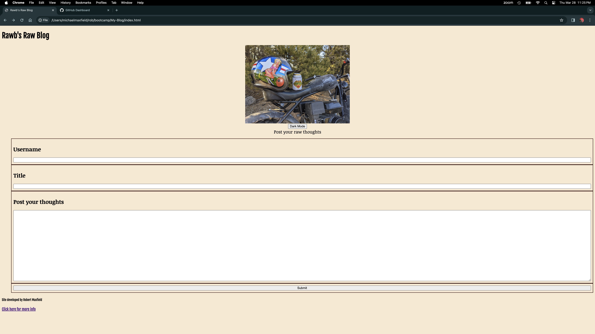
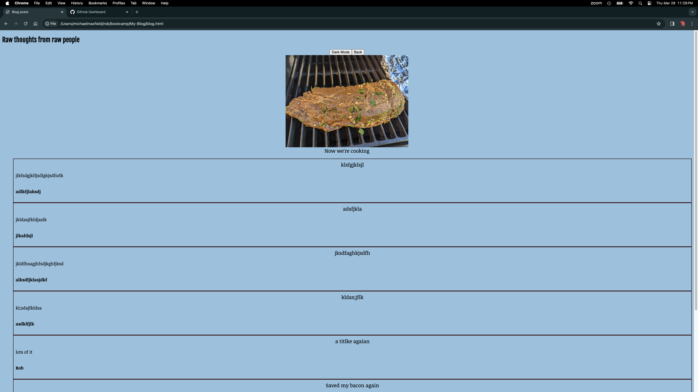

## Challenge 4 by Robert Maxfield

## User Story

```md
AS A marketing student,
I WANT a personal blog
SO THAT I can showcase my thoughts and experiences.
```

## Acceptance Criteria

```md
GIVEN a personal blog
WHEN I load the app,
THEN I am presented with the landing page containing a form with labels and inputs for username, blog title, and blog content.
WHEN I submit the form,
THEN blog post data is stored to localStorage.
WHEN the form submits,
THEN I am redirected to the posts page.
WHEN I try to submit a form without a username, title, or content,
THEN I am presented with a message that prompts me to complete the form.
WHEN I view the posts page,
THEN I am presented with a header, with a light mode/dark mode toggle, and a "Back" button.
WHEN I click the light mode/dark mode toggle,
THEN the page content's styles update to reflect the selection.
WHEN I click the "Back" button,
THEN I am redirected back to the landing page where I can input more blog entries.
WHEN I view the main content,
THEN I am presented with a list of blog posts that are pulled from localStorage.
WHEN I view localStorage,
THEN I am presented with a JSON array of blog post objects, each including the post author's username, title of the post, and post's content.
WHEN I take a closer look at a single blog entry in the list,
THEN I can see the title, the content, and the author of the post.
WHEN I view the footer,
THEN I am presented with a link to the developer's portfolio.
```

## Development Process

For this project, I began by creating a basic HTML framework with only the necessary elements for a simple form and landing page.
I attempted to use as simple a format as possible throughout the HTML and then build out the blog post elements through JavaScript.
Each HTML page is linked to two seperate stylesheets and script files, one each for general use and then a stylesheet and script file specifically for the form elements.
All code was written by me from scratch. API's used include JSON, local storage, and Google Fonts.
As my web portfolio is not finished, I linked to a new repo I plan to build throughout the rest of this bootcamp.
Below are screenshots of the deployed applications.





